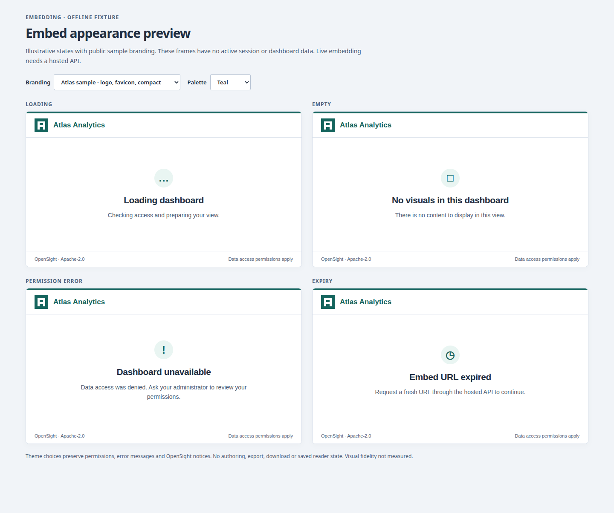

# OpenSight

[](LICENSE)
[](package.json)

An open-source BI platform aiming for full QuickSight capability parity and
bidirectional asset compatibility — connect data, prepare datasets, build
analyses and dashboards, and ask questions in natural language. Self-hosted;
no AWS required.


*Above: the offline demo — a dashboard, the O natural-language bar answering
"revenue by region", branching data preparation, and the connector gallery.*

## Features

### 📊 Dashboards and analyses

Author on a QuickSight-style canvas: 18 visual types (bar, line, pie/donut,
KPI, table, pivot, scatter, combo, maps and more), parameters and controls,
filter actions, drill-down, themes, and `.qs` bundle import/export round trips.


### 🛠️ Visual data preparation

Build your own datasets on a transformation pipeline canvas: select fields,
add calculated columns, change types, rename, filter — and combine sources
with join/append steps. Branch from an earlier step, choose the output, and
preview each path against the hosted API.


### ⚡ Blaze cached datasets

Cache prepared datasets in the self-hosted API with manual or scheduled refresh,
bounded memory, visible refresh times and explicit failures. Cross-source joins,
pivot, unpivot, append and aggregate on the output path require Blaze; simple
single-source pipelines can use direct query. The static demo keeps these hosted controls disabled.
See [Blaze configuration and limits](docs/blaze.md).


### 🔌 Data source connectors

A 23-connector gallery: CSV/TSV/JSON/Excel file uploads into DuckDB staging,
MySQL and PostgreSQL with bounded execution, plus SaaS and AWS connectors
with honest availability states — unimplemented sources say so instead of
failing silently.


### 💬 Ask O

A natural-language entry point over your data. A local deterministic
interpreter answers offline; administrators can configure a real AI provider
(OpenAI, Anthropic, Bedrock, or a custom endpoint) for generative answers,
gated by role.

### 👥 Built for teams

Five roles (administrator, author, author_ai, reader, reader_ai), single-use
invitations, row/column security with namespaces, folders, asset sharing, an
embedding SDK with signed URLs, scheduled refreshes, and dashboard reports.

### 🖼️ Embed appearance preview

Tenant administrators can configure exact parent origins, bounded lifetimes and
safe appearance tokens within operator policy. An offline preview covers loading,
empty, permission-error and expiry states with sample branding. Hosted embed
sessions and custom domains remain gated; the existing signed-URL SDK keeps its
v1 behavior. See [embedding configuration](docs/embedding-config.md).



## Quick start

Requires Node 24+ and npm. From the repository root:

```bash
npm ci
npm run build
npm test
```

Start the local API with `npm start --workspace @opensight/api` and, in a second
terminal, run `npm run dev --workspace @opensight/web`. Open
`http://127.0.0.1:5173`. With no authentication configured, the welcome screen
offers setup guidance and **Explore sample data**, an explicit fixture-only demo
with no hosted session. See the [first-run guide](docs/first-run.md) for the
existing auth settings, integration steps and demo security boundaries.


Parse a real QuickSight export:

```bash
npm run summarize --workspace @opensight/bundle-parser -- fixtures/real-bundle-sample/TotalDeathByCountry.sanitized.qs
```

Expected [CLI output](fixtures/sample-sales-analysis.summary.txt) and
[JSON summary](fixtures/sample-sales-analysis.summary.json) are checked by
tests. The suite includes malformed-input regressions, public-entry
typechecking, local SQL data-oracle checks, generated DuckDB query/result
comparisons, and fail-closed execution checks for unsupported features and
protected/unresolved datasets.

After building, workspace consumers can import the public API:

```ts
import { loadQsBundle, summarizeQsBundle } from '@opensight/bundle-parser';
const inventory = summarizeQsBundle(await loadQsBundle('fixtures/real-bundle-sample/TotalDeathByCountry.sanitized.qs'));
```

`loadBundle` remains a historical alias for `loadSyntheticAnalysis`. Validation
errors include JSON paths and, for archive members, their ZIP path. Unknown
properties are retained; inventory success does not imply full schema validity
or execution support. Synthetic summary titles retain their `plain`/`rich`
format; rich markup is raw text and must not be inserted directly into HTML.

## Layout

```
packages/bundle-parser  Observed .qs archive import + synthetic JSON inventory
packages/api            Local definition and dataset-query API
packages/web            React renderer + authoring and bundle round trips
packages/query-engine   Typed synthetic planner + local DuckDB CSV executor
packages/cli            Archive import/export/validate (planned)
docs/research           Observed format and API contract research
fixtures                Sanitized real export + synthetic regression specifications
conformance             Controls-to-query integration; source fidelity planned
```

## Documentation

**Start here:** [SOLUTION_DESIGN.md](SOLUTION_DESIGN.md) records the vision,
architecture, decisions and phased plan. Feature guides live in
[docs/](docs/): [bundle round trips](docs/bundle-roundtrip.md),
[interactive controls](docs/parameters-controls.md),
[visuals and themes](docs/phase2d-visuals-themes.md),
[scheduled refresh, reports and alerts](docs/scheduled-refresh-reports-alerts.md),
[security and namespaces](docs/security-namespaces.md),
[folders, sharing and embedding](docs/folders-sharing-embedding.md),
[tenant embed configuration and appearance](docs/embedding-config.md),
[data preparation](docs/data-prep.md), and the
[connector gallery](docs/connector-gallery.md). The hosted metadata foundation and
offline migration runbook are in [H1 tenant metadata](docs/h1-tenant-metadata.md);
hosted HTTP/session composition follows in H2.

## Contributing

Spec-first: propose the change against `SOLUTION_DESIGN.md`, build it on a
branch with checkpoint commits, verify the full suite (`npm test`), and keep
the README visuals fresh — every user-facing change refreshes the tour GIF
and screenshots above (see `AGENTS.md` §4).

## License

[Apache 2.0](LICENSE). Dependencies are MIT/Apache-2.0 only.
