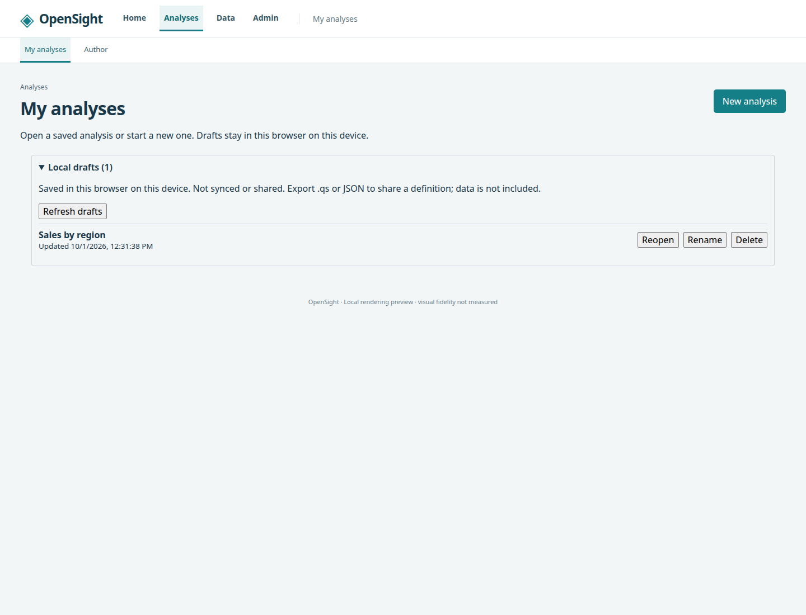

# App navigation

The application opens **Home**, the pinned sample dashboard from issue #28.
The shared header provides Home, Analyses, Data, and Admin, with an active
section and a title for the current screen. This implements the issue #31 run
brief; `SOLUTION_DESIGN.md` is unchanged.

| Section | Screen | Former mode |
| --- | --- | --- |
| Home | Sample dashboard | sample |
| Analyses | My analyses: device-local draft list | Local drafts in Author (#32) |
| Analyses | Author workspace | author |
| Data | Data preparation; Data sources | data-prep; data-sources |
| Admin | Security & namespaces; Folders, sharing & embedding; Schedules & alerts | security; organization; automation |
| Admin | AI provider settings; Users and invitations | ai-settings; users |
| Admin → Developer tools | Fixture preview; API definition preview | fixtures; api |

Analyses lists drafts by name and updated time, newest first, with Reopen,
Rename, Delete, and Refresh drafts. New analysis starts a blank analysis.
Reopen links to that draft in Author. The existing #32 storage format,
local/demo/hosted-user separation, validation, limits, source recovery, and
export fallback apply. These are browser-local definitions, not a server list
or shared analyses. See [local drafts](local-drafts.md).

## Visibility and permissions

Home and Admin are available in all three modes. Analyses and Data require
the existing `allowed(access, 'build')` check: local and demo users can build;
hosted authors and administrators can build; hosted readers cannot.

Security, folders/sharing/embedding, and schedules/alerts retain their existing
informational screens and hosted-only guidance in every mode. AI settings and
Users appear only for a hosted administrator, using the existing
`allowed(access, 'admin')` check. Developer fixture preview is available in
demo or with build permission. API definition preview is disabled in demo
(“Needs hosted API”), and retains its local/hosted client and resource gates.
Developer tools are secondary links inside Admin, never product navigation or
the default landing. Direct links apply the same gates before mounting a screen.

## URLs and browser history

Routes use URL fragments (`#/home`, `#/analyses`, `#/analyses/new`,
`#/analyses/author`, `#/analyses/drafts/<id>`, `#/data/preparation`,
`#/data/sources`, and `#/admin/...`). They work in both the static single-file
demo and the connected app without server rewrite rules or a routing dependency.
Ordinary links change the view without reloading the document; browser Back
and Forward restore the route. The existing `#invite=...` flow is unchanged.
Unknown routes show recovery links; denied routes show a named access error.
Missing or corrupt drafts show the storage error, never a different saved draft.

Draft links work only where the corresponding collection exists (same origin,
browser, device, and local/demo/hosted identity). Navigation, Back, and reload
do not autosave: use Save draft before leaving Author, as in #32. Opening
Author without a draft ID restores the last saved draft; New analysis starts
blank. Opening a draft by URL restores its saved definition and rechecks its
source using the existing editor behavior.

Saving or reopening a different draft inside Author replaces the current
history entry with its draft URL without resetting the editor. Starting an
unsaved analysis inside Author uses the generic Author URL until it is saved.
Thus Back returns to the preceding screen instead of stepping through saves.
