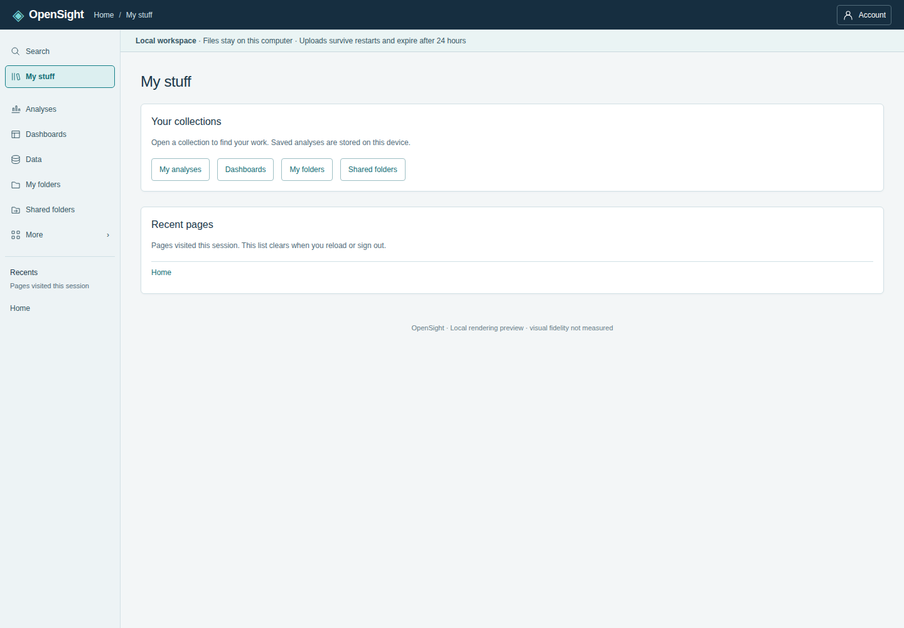

# App navigation

The local application opens an empty **Home**, ready to upload data. **Try sample
data** explicitly enables the labeled sales sample from issue #28. The static
demo retains its staged showcase. The issue #64 left rail provides **Search**,
**My stuff**, **Analyses**, **Dashboards** (local only), **Data**, **My folders**,
**Shared folders**, and **More**, followed by **Recents**. Build-only links keep
their permission gates. Search opens the existing #53 command palette. More
expands the Admin and developer links. The top band has a breadcrumb and an
account disclosure; hosted users can sign out there. Home remains accessible
through the brand, breadcrumb, and command palette. `SOLUTION_DESIGN.md` is
unchanged. See the [reference mapping and gap notes](issue-64-gap-notes.md).

| Section | Screen | Former mode |
| --- | --- | --- |
| Home | Local: add data or opt into a sample; demo: sample dashboard | sample |
| My stuff | Available collection links and pages visited this session | — |
| Dashboards (local only) | Empty list; publishing needs hosted API | — |
| Analyses | My analyses: device-local draft list | Local drafts in Author (#32) |
| Analyses | Author workspace | author |
| Data | Data preparation; Data sources | data-prep; data-sources |
| My folders / Shared folders | Honest folder-browsing empty states; link to folder/sharing guidance | — |
| Admin | Security & namespaces; Folders, sharing & embedding; Schedules & alerts | security; organization; automation |
| Admin | AI provider settings; Users and invitations | ai-settings; users |
| Admin → Developer tools | Fixture preview; API definition preview | fixtures; api |

Recents shows up to five distinct previously visited pages, newest first. It
contains no staged assets, draft IDs, or persisted browsing history, and resets
on reload or identity changes. Author is excluded so a recent link cannot
restore a different draft. My stuff shows the same session history. Folder
screens do not fetch or manage folders; in hosted mode they explicitly say
folders have not been loaded, rather than claiming that the account is empty.

Below 761px, and in Author at all widths, the rail opens with **Toggle
navigation**. It closes on a route change, Search, Escape, or backdrop click.
Long rail contents scroll. More opens automatically for an Admin deep link.

Analyses lists drafts by name and updated time, newest first, with Reopen,
Rename, Delete, and Refresh drafts. New analysis starts a blank analysis.
Reopen links to that draft in Author. The existing #32 storage format,
local/demo/hosted-user separation, validation, limits, source recovery, and
export fallback apply. These are browser-local definitions, not a server list
or shared analyses. See [local drafts](local-drafts.md).

## Visibility and permissions

Home, My stuff, folder entry screens, and Admin are available in all three modes.
Dashboards is local-only. Analyses and Data require
the existing `allowed(access, 'build')` check: local and demo users can build;
hosted authors and administrators can build; hosted readers cannot.

Security, folders/sharing/embedding, and schedules/alerts retain their existing
informational screens and hosted-only guidance in every mode. AI settings and
Users appear only for a hosted administrator, using the existing
`allowed(access, 'admin')` check. Developer fixture preview is available in
demo or with build permission. API definition preview is disabled in demo
(“Needs hosted API”), and retains its local/hosted client and resource gates.
Developer tools are secondary links inside Admin, never product navigation or
the default landing. Direct links apply the same gates before mounting a screen.

## URLs and browser history

Routes use URL fragments (`#/home`, `#/my-stuff`, `#/folders/mine`,
`#/folders/shared`, `#/dashboards` (local only), `#/analyses`, `#/analyses/new`,
`#/analyses/author`, `#/analyses/drafts/<id>`, `#/data/preparation`,
`#/data/sources`, and `#/admin/...`). They work in both the static single-file
demo and the connected app without server rewrite rules or a routing dependency.
Ordinary links change the view without reloading the document; browser Back
and Forward restore the route. The existing `#invite=...` flow is unchanged.
Unknown routes show recovery links; denied routes show a named access error.
Missing or corrupt drafts show the storage error, never a different saved draft.

Draft links work only where the corresponding collection exists (same origin,
browser, device, and local/demo/hosted identity). Navigation, Back, and reload
do not autosave: use Save draft before leaving Author, as in #32. Opening
Author without a draft ID restores the last saved draft; New analysis starts
blank. Opening a draft by URL restores its saved definition and rechecks its
source using the existing editor behavior.

Saving or reopening a different draft inside Author replaces the current
history entry with its draft URL without resetting the editor. Starting an
unsaved analysis inside Author uses the generic Author URL until it is saved.
Thus Back returns to the preceding screen instead of stepping through saves.
