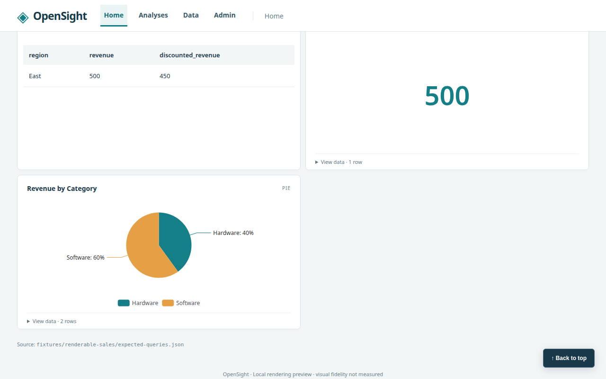

# Back to top

The shared application shell mounts one **↑ Back to top** button for long
pages, including Home's sample dashboard, dashboard definition previews, and
the connector gallery. These pages scroll in the browser window; scrolling
inside a chart, table, or side panel does not trigger the control.

The button appears in the bottom-right corner when `window.scrollY > 600`
pixels and is removed when the page returns to 600 pixels or less. It also
checks the current position on mount, so restored scroll positions work.
Its passive scroll listener is removed when the shell unmounts.

Clicking the button calls `window.scrollTo({ top: 0, behavior: 'smooth' })`.
When `prefers-reduced-motion: reduce` matches, it uses `behavior: 'auto'`
for an immediate jump. The preference is checked on each activation. Visibility
follows scroll events, including those generated while returning to the top.

The control is a native button with visible text and the accessible name
**Back to top**. It supports Tab focus, Enter, and Space, with the application's
visible focus outline. When hidden it is absent from the DOM and tab order.
It uses navy chrome, 12px Arial/system fallback text, and 4/8px spacing.
It needs no backend, configuration, toast, or additional dependency.

The component and application integration tests in
`packages/web/test/back-to-top.test.mjs` run through the existing web test glob
and root `npm test`. They cover the threshold in both directions, initial scroll
restoration, smooth and reduced-motion activation, preference changes, passive
listener cleanup, and a single shared instance across the supported pages.
