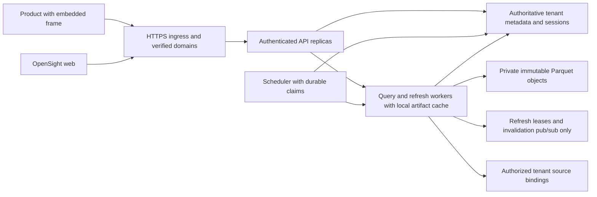

# Hosted multi-tenant architecture — draft

Status: proposal for review, not an implementation or deployment authorization.
The hosted and embeddable/white-label direction is accepted; the recommendations,
API additions, operating targets and rollout below still need design approval.
Single-node self-hosting remains the default product.

This draft reads [SOLUTION_DESIGN.md](../SOLUTION_DESIGN.md) as the contract,
especially D13, Phase 5, Phases 3b/3c and §§12–14. It does not amend that document.
Its older §2 hosted non-goal and D11/D12 deployment assumptions need reconciliation
with the later hosted direction when this draft is reviewed. Phase 5's business
trigger has been met by that direction; scale-out implementation is not thereby
scheduled. Statements labeled **Current** describe surveyed code. **Proposed** and
**Recommendation** describe future work. `HQ-*` references identify open questions
collected in §7; proposed error codes and environment variables are not shipped.

## 1. Goal & non-goals

Provide an optional hosted service in which independent tenants can author and
consume analyses, dashboards and prepared datasets, with authenticated embedding
inside another product. Preserve QuickSight-compatible asset semantics, namespace
principals, sharing, RLS/CLS and portable definitions while adding an operational
tenant boundary. Make branding configurable without presenting security or
unsupported functionality as cosmetic choices.

The hosted option must support a safe first deployment on one node and a measured
path to multiple instances. Scaling must preserve D13's execution modes, refresh
lifecycle, named errors and provenance through the `refresh(key, load)` / `read(key)`
boundary. No customer should receive another tenant's definitions, query results,
cached rows, credentials, report contents or job history. Resource limits must
bound interference; shared infrastructure does not promise physical isolation.

**Non-goals for this draft's first rollout:** billing vendor integration, pricing
or subscription tiers (usage/entitlement hooks only); multi-region operation;
distributed analytical execution; guaranteed service levels without measurements;
anonymous embedding, embedded authoring or cross-tenant sharing by implication;
an organization hierarchy or dedicated tenant deployments without a demonstrated
need. Those product choices remain explicit questions.

The work here is documentation only. It introduces no dependency, implementation,
infrastructure, credentials or external-service operation. A future reference
deployment starts with Docker Compose; Helm is a later packaging option. Neither
is a claim that a service has been deployed. The static demo continues to say
“Needs hosted API” for unavailable functionality and “visual fidelity not measured.”

Success for a future hosted build requires tenant isolation and bypass tests on
every data path, restart and recovery tests, measured fairness under concurrent
tenants, and embed authorization/browser tests. DuckDB, Postgres and fixture/shared
post-processing paths must agree on enabled semantics. Passing local regression
tests is not proof of QuickSight API, rendering or service-level parity.

## 2. Tenancy model

### Existing primitives and limits

The survey baseline is commit `10fea78f`. These are implementation facts, not
inferences from the phase names:

| Current code | What it establishes | What it does not establish |
| --- | --- | --- |
| [security.ts](../packages/api/src/security.ts), [namespace-routes.ts](../packages/api/src/namespace-routes.ts) | `Identity = {namespaceId, userId}`; namespace-local users, groups, roles, invitations and dataset policies; namespace-prefixed routes must match the authenticated identity | A tenant lifecycle, global organization membership, built-in login or platform-operator role |
| [organization.ts](../packages/api/src/organization.ts), [sharing.ts](../packages/api/src/sharing.ts) | Flat folders, analyses/dashboard references or copies, namespace-local viewer/co-owner grants; folder and asset restrictions both apply | An organization entity or parent/child hierarchy; sharing does not grant dataset access |
| [index.ts](../packages/api/src/index.ts), [store.ts](../packages/api/src/store.ts) | Trusted startup data roots per namespace; overlap rejected; unconfigured namespaces have no fallback to default | Dynamic hosted asset storage; the sales bindings still require matching schemas |
| [prep-routes.ts](../packages/api/src/prep-routes.ts), [connector-routes.ts](../packages/api/src/connector-routes.ts) | Prepared datasets and sources resolve by namespace and owner; Blaze keys encode `[namespaceId, userId, datasetId]`; upload staging is per owner | Shared prepared datasets, durable uploads across nodes or arbitrary protected-source execution |
| [automation-store.ts](../packages/api/src/automation-store.ts), [automation-state.ts](../packages/api/src/automation-state.ts) | Cloned in-memory state, optional single-process atomic JSON replacement | Database transactions across stores/processes; legacy refresh/report/alert records have no namespace field |
| [ai-settings.ts](../packages/api/src/ai-settings.ts) | Namespace-local provider configuration and encrypted saved keys | A general tenant secret service or distributed configuration store |

Roles currently include `administrator`, `author`, `author_ai`, `reader` and
`reader_ai`. A namespace administrator can create an unused namespace through PUT;
the code copies that administrator into it but issues no credential. This is a
self-hosted registry operation, not hosted tenant onboarding. Legacy automation is
restricted to the default namespace's administrator when security is configured.
Prepared-dataset refresh scheduling is separately keyed by namespace and owner.

### Options and recommendation

| Option | Benefit | Cost or risk |
| --- | --- | --- |
| One namespace per tenant, plus a small tenant lifecycle record | Reuses every existing identity and sharing boundary; simplest isolation audit and migration | A tenant cannot yet have independently administered sub-workspaces; multi-tenant users need explicit tenant sessions |
| Organization with several member namespaces | Supports product accounts containing teams/environments; organization-wide lifecycle and configuration | New identity/membership model, delegation rules, inheritance and namespace switching; `OrganizationService` supplies none of these today |
| One shared namespace with a tenant column in application data | Fewer namespace records | Asset, principal, folder, secret and scheduler separation would need rebuilding; RLS alone cannot isolate metadata; reject for the initial design |
| Separate deployment/database per tenant | Smaller resource and failure blast radius | Provisioning, upgrades and capacity overhead; a placement option if isolation needs justify it, not the default |

**Recommendation, pending HQ-1:** introduce an opaque `tenantId` with exactly one
member namespace initially. Keep namespace IDs globally unique within a deployment,
and enforce a unique tenant-to-namespace mapping. Do not rename namespaces to
organizations or change portable QuickSight definitions. The tenant record holds
lifecycle, configuration revision, placement and limit-policy references, not data
grants. This permits a later one-to-many relationship without granting access across
namespaces now. An organization concept, if approved, is separate from folders.

The authenticated request context becomes a server-created
`{tenantId, namespaceId, userId, authorizationRevision}`. Derive `tenantId` from
the verified namespace membership; never accept it as authorization from a body,
query string, imported bundle or arbitrary header. One external identity may map
to several memberships, but each session selects and verifies exactly one. A
tenant administrator is not a platform operator. Operator provisioning credentials
must use a separate audience and permission boundary, with audited operations and
no automatic right to query tenant data.

**Proposed storage invariants:** composite unique keys and foreign keys include
tenant and namespace on assets, policies, users, groups, folders, jobs, sources,
secrets and revisions. Prepared datasets additionally retain `ownerUserId` until
sharing semantics are approved (HQ-4). Globally unique IDs do not replace scoped
lookups. Database accessors require the authenticated context; transactional tenant
row policies provide a second boundary where supported. Imported IDs/ARNs are
portable references to rebind within that context, never storage paths or grants.

### Onboarding and lifecycle

**Proposed operator API:** `POST /api/host/tenants` accepts a display name and an
initial administrator's verified external-subject reference. A required idempotency
key is scoped to the operator and payload hash. It returns `201` with
`{tenantId, namespaceId, state: "provisioning", operationId}`; replay returns the
same operation, while reuse with a different payload returns `409`.
`GET /api/host/operations/{operationId}` exposes safe progress/errors, and
`GET /api/host/tenants/{tenantId}` returns lifecycle and configuration revision.
These are OpenSight administration proposals, not QuickSight API action shapes.

1. In one metadata transaction, reserve opaque IDs, record the operation, create
   the namespace and administrator membership, set default limits and keep data
   access disabled. Do not copy fixture assets, default secrets or another
   tenant's source bindings.
2. Idempotently establish server-owned source/storage prefixes, configuration and
   invitations. Any external work is recorded durably for retry, not hidden inside
   a database transaction. Failed provisioning stays inaccessible with a safe
   error and resumable operation; compensation removes only resources it owns.
3. Verify authentication mapping, tenant constraints and required configuration,
   then atomically mark `active`. Missing optional embedding/SMTP/AI configuration
   leaves those capabilities explicitly unavailable, not the tenant falsely ready
   for them. Credentials are delivered through the identity system, never returned
   in metadata responses or committed configuration.
4. Hosted mode restricts the existing namespace-creation path to this provisioner;
   tenant administrators cannot create untracked tenants or escape quotas. Signup
   and tenant-admin delegation are product choices in HQ-2.

`POST /api/host/tenants/{tenantId}/suspend` and `/resume` are proposed audited,
idempotent transitions. Suspension increments the authorization revision, blocks
new requests and job admission, revokes sessions/embeds and cancels queued work;
in-flight work rechecks before publishing. `DELETE` starts a tracked `deleting`
operation, not immediate blind row removal. Revoke access first, then remove
artifacts, uploads, secrets and metadata under the approved retention policy.
Retain a deletion tombstone so retries/restores cannot resurrect access. Retention,
backup purge timing and tenant-admin deletion authority remain HQ-10.

## 3. Isolation guarantees

These are **proposed acceptance guarantees** for a hosted release, not claims that
today's API is ready for untrusted multi-tenant traffic. The threat model includes
authenticated tenants guessing other tenants' IDs, forging identity assertions,
replaying embeds, importing malicious references and exhausting shared resources.
It does not claim isolation from a compromised host administrator or shared runtime;
stronger process/deployment boundaries are a separate requirement (HQ-8).

### Data and authorization

**Current:** [security.ts](../packages/api/src/security.ts) resolves registered
namespace users through an injected credential verifier. The HTTP boundary rejects
forged principal headers and query bodies. The query engine's
[security resolver](../packages/query-engine/src/security.ts) binds policy to both
namespace and dataset, rejects unresolved principals, ORs matching row rules and
denies protected columns unless explicitly allowed (deny wins). The
[planner](../packages/query-engine/src/planner.ts) applies RLS before user
aggregation/calculation stages and rejects denied-column references.

There are important limits: the API policy service is bound to `sales`, and absent
stored policy produces a local `rowLevel: false` default. That is not an acceptable
implicit default for an unresolved hosted dataset. Prep accepts trusted
`unrestricted` source bindings and rejects protected ones; cached prepared queries
do not yet implement general per-reader RLS/CLS. Asset sharing is independent of
dataset permissions. Administrators bypass folder/asset restrictions, not row and
column policies.

**Required hosted ordering:**

1. Authenticate the session/service credential, resolve active tenant membership
   and required capability, then perform a scoped asset lookup. Unknown or foreign
   resources use the same not-found response, including list/search/history paths.
2. Resolve the entire dataset/source dependency graph through trusted bindings.
   Require explicit security metadata for every leaf. Reject absent policy,
   unsupported protection or cross-tenant references before opening a source,
   compiling a preview or reading an artifact.
3. For a physical relation containing multiple tenants, apply an immutable
   server-bound tenant predicate **AND** the user's RLS predicate. User row-rule
   ORs, parameters, joins, PRE_FILTER calculations and administrators cannot widen
   this outer boundary. A tenant-specific source still requires ownership and
   source authorization; a namespace name alone does not filter shared rows.
4. Resolve CLS over all dependent physical columns, including calculations,
   filters, sorts, grouping and exports. Reject denied references by name rather
   than silently removing columns. Execute SQL-mappable rules in the dialect
   layers and retain equivalent server-side semantics for cached/fixture paths.
5. Recheck authorization, policy and resource revisions before publishing results
   after asynchronous execution. A change during execution cancels publication.
   No metadata/auth availability failure permits a fallback to default or stale
   policy. Already delivered browser data cannot be recalled.

Use composite database constraints plus transaction-local tenant context, including
pooled-connection cleanup; application roles must not bypass row policies or own
tables in a way that defeats them. Test missing context and reused connections.
Apply the same checks to preview, output rows, visual queries, downloads, reports,
alerts, AI/schema access and source discovery. Never hand object-store credentials
or raw Blaze URLs to a browser.

**Prepared data gate:** initially retain owner-scoped prep and the protected-source
refusal (`PREP_SECURITY_REJECTED`). Before sharing or embedding arbitrary prepared
datasets, choose and prove either (a) tenant-only raw snapshots with per-reader
RLS/CLS before every aggregation, or (b) snapshots partitioned by a stable effective
security context, with policy/principal revision in their identity. Aggregation can
erase security columns, making later row filtering impossible. Until that is solved
for a pipeline, protected materialization is unsupported; neither a refresher's
administrator identity nor a tenant-prefixed key grants readers its data. HQ-4
covers the product scope; the isolation requirement is mandatory in either model.

§14's prep graph remains authoritative: earlier-step `from`, explicit/default
output, at most five consumers, full-stage validation and output-path
materialization rules. Namespace isolation applies to all reusable dependencies
and disconnected preview branches, not just the selected output. Preserve graph,
expansion and result budgets; importing a pipeline grants no source access.

### Auth, sessions and embedding

**Current:** `/api/session` reports the verified user; it is not a login/session
store. `SecurityOptions.authenticate` supplies verification. The shipped CLI does
not wire a hosted verifier, and SDK SSO is a stub. No hosted identity provider is
selected by this document (HQ-3).

**Proposed:** hosted startup must refuse to expose tenant routes without a verifier,
durable membership store and trusted public-origin configuration. Keep session
records or revocation/version records in authoritative metadata, scoped by tenant,
namespace, subject and audience. Verify issuer, audience, expiry and current
membership; switching tenant requires an explicit verified session exchange.
Cookie sessions, if selected, use secure, HTTP-only, host-only cookies and CSRF
protection; never share cookies across customer domains. Browser storage and cache
keys include the tenant and are cleared on switch/logout. Service credentials stay
on the embedding product's server and cannot become broad browser API credentials.

Tenant suspension, user removal, policy changes and key/config rotation must take
effect for subsequent authorized operations on every node. The safe initial model
reads authoritative revisions on each request; any later caching requires a
specified revocation bound and tests. Signing keys include key IDs and tenant-bound
claims; a token valid for one tenant/origin/audience must fail everywhere else.

### Compute, Blaze and scheduler fairness

**Current:** Blaze has global byte/row/cell caps, LRU eviction and one intake
reservation per process for refresh/direct materialization. Keys distinguish
namespace and owner, but one tenant can consume capacity or force another's
eviction. Accounted bytes are not a process RSS limit. Upload staging/queues and
DuckDB working memory add separate costs. These are bounds, not fair scheduling.

**Proposed:** admission requires both a tenant budget and a node budget. Bound
concurrent queries, refreshes, source connections, uploads, queued jobs, decoded
snapshot bytes, artifact/disk bytes, result bytes and execution time. Start with
equal tenant admission shares and bounded per-tenant queues; weights/tier values
remain HQ-8. Reserve refresh capacity so a query burst cannot starve freshness,
and retain global headroom. Evict within a tenant's allotment before borrowing
unused shared capacity. Decline work explicitly (`TENANT_LIMIT_EXCEEDED`, proposed
429 with retry guidance); never truncate a dataset to fit. Stop/cancel execution
when budgets expire, with a safe diagnostic.

Worker processes with memory/CPU limits are the recommended next boundary when
untrusted analytical work can block the API event loop or cause process-wide
failure. Fair queues alone do not bound native memory, garbage-collection pauses,
disk pressure or shared source load. Before admitting unrelated hosted tenants,
measure contention and cancellation; reject workloads that cannot be bounded in
the chosen execution mode. Dedicated placement remains optional and unpriced.

Every job carries tenant, namespace, initiating/owning principal, target revision,
run ID and due occurrence. Reauthorize at execution and before output delivery;
never execute as an all-tenant administrator. Tenant suspension/deletion cancels
admission and publication. Scope recipients, histories, alert state and usage
records as carefully as data. Legacy automation remains default-only until its
resources and rendering path are migrated and tested. Do not merely add a
namespace field to the current unscoped snapshot service.

The hard problems are revocation racing with long queries, security through
aggregated caches, tenant restore in shared metadata, native-memory fairness,
lost invalidations, and duplicate externally visible job effects after crashes.
The release gates in §8 require failure tests for these; they are not solved by
adding tenant IDs or a distributed lock alone.

## 4. Embedding & white-label API surface

### Shipped Phase 3c contract

The [embedding service](../packages/api/src/embedding.ts),
[SDK](../packages/embedding-sdk/src/index.ts) and
[renderer](../packages/web/src/embed-main.tsx) implement the following:

| Surface | Current behavior |
| --- | --- |
| `POST /dashboards/{id}/embed-url` (also `/api/dashboards/...`) | Authenticated caller only; body `{parentOrigin, visualId?, expiresInSeconds?}`; TTL 60–900 whole seconds, default 300; response `{url, expiresAt}` |
| `GET /embed/dashboards/{id}?token=...` | HMAC-SHA256 signed bearer URL; namespace/user, dashboard/optional visual, exact parent origin, issue/expiry times and nonce; token is not encrypted and is not a general API credential |
| Server configuration | One trusted public origin and parent-origin allowlist for the process; signing secret from `OPENSIGHT_EMBED_SECRET`; no caller-selected host or client signer |
| Authorization | Current membership and folder/asset grants rechecked on load, viewer query security applied, expiry and asset grants rechecked after asynchronous rendering |
| Browser boundary | Credentialed CORS only for issuance; exact origins, CSP `frame-ancestors`, script nonce, `no-store`, `no-referrer`; URL removed from frame history after load |
| SDK | `createEmbeddingClient`, `generateEmbedUrl`, `embedDashboard`, `embedVisual`; `refresh()` and `destroy()`; ready/expired/error callbacks with origin/window checks |
| Authentication hook | `getAuthorization` plus `onAuthenticationRequired`; OIDC/SAML/exchange are not implemented; `ssoNotConfigured` is an explicit stub |

This renders a snapshot of supported visuals using the namespace's sales binding.
It has no persistent interactive data session; refresh generates and loads a new
URL. Expiry replaces the view, but cannot erase data already received. The nonce
does not make a v1 URL single-use. Current SDK validation requires the returned
origin to equal `apiOrigin` and the v1 token shape; custom origins or a new token
format need an explicit SDK upgrade. The iframe title includes OpenSight and the
renderer has fixed presentation. There is no tenant branding/custom-domain API.
See [Phase 3c documentation](folders-sharing-embedding.md) for existing limits.

### Proposed tenant configuration

All additions below are OpenSight-local versioned contracts, **not implemented**.
Continue the plain `node:http` resource/validation patterns. Preserve v1 issuance
for its current semantics; do not silently turn its token into a session token.
QuickSight compatibility applies to asset/security meaning, but exact AWS embed
actions, lifetimes and options require the pinned-contract evidence described in
SOLUTION_DESIGN §3.2 (HQ-12).

| Proposed endpoint | Authority and contract |
| --- | --- |
| `GET /api/embedding/config` | Tenant administrator; returns effective non-secret config, revision and supported capabilities |
| `PUT /api/embedding/config` | Tenant administrator within operator policy; `If-Match` revision required; replaces validated config, increments revision and revokes sessions when security settings change |
| `POST /api/embedding/sessions` | Registered user, or explicitly authorized server credential acting through a verified subject mapping; creates a bounded embed grant |
| `DELETE /api/embedding/sessions/{id}` | Issuer or tenant administrator in the same tenant; revokes grant, redemption and future requests |
| `POST /api/embedding/sessions/{id}/renew` | Reauthenticate original authority and reauthorize the subject and asset; issue fresh bootstrap URL; an expired embed token alone cannot renew |
| `POST /api/embedding/domains` | Tenant administrator if operator permits; creates a pending hostname claim and verification challenge, no active routing |
| `POST /api/embedding/domains/{id}/verify` | Verifies domain control and certificate readiness; activation is an audited state transition |
| `GET /api/embedding/domains`, `DELETE /api/embedding/domains/{id}` | Tenant administrator; inspect status or revoke routing and affected sessions |

Proposed configuration fields are `enabled`, `allowedParentOrigins`,
`embedOriginId`, `maxSessionSeconds`, `appearance` and `features`. A server-owned
registry resolves `embedOriginId`; a body cannot supply an arbitrary signing or
redirect origin. `appearance` can reference a tenant-owned theme and validated
logo/favicon assets, plus bounded text such as product name and iframe title.
Use approved color/font/layout tokens, not executable HTML, arbitrary CSS or
unrestricted external asset URLs. Theme resources retain their existing portable
meaning; service chrome/branding metadata lives separately. Light/dark behavior,
which chrome can be removed and whether branding removal is available to everyone
are HQ-5. Required legal notices are not a UI theme switch.

`features` describes supported capabilities such as parameter controls, filtering
or export; it cannot confer authorization. Unsupported flags fail with proposed
`EMBED_FEATURE_UNSUPPORTED` (422), not a simulated control. Embedded authoring,
anonymous access, exports and saved reader state require explicit product choices
(HQ-6). Configuration edits use optimistic concurrency (`412` on revision conflict),
reject unknown fields and enforce operator caps. A tenant cannot widen its origin
list beyond operator policy or set an unbounded session lifetime. Exact caps and
default session lifetime remain HQ-7; the existing v1 TTL is unchanged.

### Proposed session issuance and browser flow

The session request contains `{dashboardId, visualId?, parentOrigin,
requestedDurationSeconds?, initialParameters?}`. The server resolves tenant and
user from authentication. A product backend integration may additionally submit
an external-subject reference **only** when its server credential is allowed to
use a preconfigured subject-to-membership mapping. No request may assert groups,
roles, raw policy or an arbitrary target namespace. Unresolved subjects fail closed;
no implicit just-in-time user creation is assumed (HQ-3).

The response is proposed as `{sessionId, url, bootstrapExpiresAt, sessionExpiresAt,
configRevision, capabilities}`. Bind the signed bootstrap to tenant, namespace,
subject, dashboard/version or visual scope, exact parent and embed origins,
audience, key ID, revision, nonce and expiry. A durable atomic redemption record
makes the new bootstrap single-use; concurrent replay fails. Authorize again on
redemption, renewal and every data request. Parameters are typed interaction
values, not tenant predicates, and unsupported interactions fail explicitly.

After redemption, deliver only an embed-scoped credential to the frame, held in
memory for API authorization. Remove the bootstrap URL from history and prohibit
logging its query string at every proxy hop. Keep session state/revocation in
metadata, not coordination pub/sub. This proposed bearer flow avoids requiring
third-party cookies; cookie-based alternatives and browser coverage need HQ-7's
decision. Do not transfer the frame credential to the parent through `postMessage`.
The signing and encryption keys always remain server-side.

The SDK extension adds a versioned session transport, explicit allowed embed
origins from trusted application configuration, and `sessionExpired`,
`authorizationRevoked` and structured error events. Validate both message origin
and source window and associate events with the active session/refresh generation.
Never disable origin checks to support custom domains. The renderer polls or
reauthorizes on interaction according to the approved revocation bound; a hosted
status loss makes protected content unavailable. Immediate recall of a captured
snapshot is impossible and must not be promised.

Proposed safe errors include `EMBEDDING_NOT_CONFIGURED` (existing, 503),
`EMBED_ORIGIN_DENIED` (existing, 403), `INVALID_EMBED_TOKEN` (existing, 401),
`EMBED_SESSION_EXPIRED` / `EMBED_SESSION_REVOKED` (new, 401),
`EMBED_SUBJECT_UNRESOLVED` (new, 403), and `EMBED_DOMAIN_UNVERIFIED` (new, 409).
Responses must not reveal another tenant's membership or domain owner. Unrelated
existing API error envelopes are not silently standardized by this proposal.

### Custom domains and white-label gaps

Treat product parent origins and OpenSight embed origins as distinct allowlists.
A verified customer hostname may route only to its registered tenant. Check the
trusted host mapping against authenticated tenant and token audience; never choose
tenant identity from `Host` alone. Enforce globally unique active/pending hostname
claims, HTTPS certificate lifecycle, exact parent origins, trusted proxy headers
and safe handling of unknown hosts. Domain removal/reassignment invalidates old
sessions and certificates/routing; stale DNS must not permit takeover. Ownership
verification, certificate automation, renewal failure and quotas need a reviewed
operational design before enabling domains (HQ-9).

White-label completeness also includes loading/empty/error/expiry pages,
accessibility titles, help links, favicon, emails and exports if those surfaces
are offered. Branding must not hide data freshness, permission failures or
unsupported functionality. Theme preview and screenshot tests should cover these
states. Which surfaces are in the first release is HQ-5, not inferred from the
phrase “like QuickSight.”

## 5. Scaling plan

### Triggers and placement of state

D13 is the architectural decision: content-addressed Parquet on shared object
storage, per-node local memory/loading or memory mapping, and Redis **or an
equivalent** for distributed refresh locks and invalidation pub/sub only. Do not
store columnar snapshots, sessions, authoritative manifests, metadata or durable job
queues in that coordination service. A specific Redis distribution is not selected;
the license constraint and a permissively licensed candidate are discussed in §6.

| Step | Evidence that triggers it | What changes | What stays single-node |
| --- | --- | --- | --- |
| Default self-hosted | Existing local workload fits one node | Nothing: file/ephemeral stores, host auth callback, in-process Blaze and scheduler remain supported | Everything; restart empties Blaze |
| Hosted correctness foundation | Decision to admit independent hosted tenants, already made in direction | Durable tenant metadata, verified auth, tenant-bound data paths, limits, lifecycle and embed configuration; storage migration required before real tenant admission | One API/query node, one scheduler, in-process Blaze; no coordinator or distributed artifact backend required yet |
| Worker separation/fairness | Load tests show refresh/query contention, event-loop stalls, inadequate cancellation or memory isolation | Bounded worker processes and tenant admission; durable jobs if workers run independently | One placement/node may still suffice; this is not distributed analytical execution |
| Shared Blaze backend and multiple instances | A second serving instance, an HA requirement, or measured concurrent load exceeds a node at approved limits | D13 artifacts, shared manifests, distributed coordination, node caches; shared identity/asset/source state must already be complete | Each individual query still executes on one worker; metadata and object services may initially have a single endpoint, which is not HA |
| Operational HA and later placement | Approved availability/recovery targets or measured single-service bottlenecks | Redundant supporting services, tested failover, optional tenant placement pools; Helm only when operators need it | No multi-region or distributed query engine is implied |

Measure query/refresh p95/p99 latency, queue delay, rejection rates, working memory,
source connection pressure, disk/cache churn and scheduler lag. Establish workload
fixtures, observation windows and targets before choosing capacity thresholds
(HQ-8/HQ-10); tenant count alone is not a useful trigger. A business HA requirement
can trigger multiple nodes before throughput does. Sticky sessions cannot satisfy
the shared-state prerequisite or replace D13.

Before a load balancer targets a second node, migrate security/folders/shares,
AI settings, prep metadata, imported definitions, sessions, source bindings and job
state from startup/file snapshots to authoritative tenant-scoped storage. Uploads
need durable tenant-owned objects and metadata, or an explicit expiration/re-upload
contract; in-process DuckDB staging cannot be reached safely from arbitrary nodes.
Do not place `AutomationStore` JSON files on a shared volume: atomic rename does
not provide cross-process serialization or coherent readers.

### Artifact identity and publication

**Current:** [blaze.ts](../packages/api/src/blaze.ts) keeps `BlazeTable` JS column
vectors in the API heap. Refresh releases old readable rows, reserves capacity,
builds a bounded table and publishes only if its generation still matches. Reads
are synchronous and return a `BlazeTable`; there is no Parquet backend or memory
mapping implementation today.

**Proposed D13 extension:** retain the semantic `refresh(key, load)` / `read(key)`
boundary but introduce an internal adapter for asynchronous artifact hydration and
a compatible table/sink interface. The current synchronous method signatures cannot
perform remote I/O unchanged. Mode/status/error/provenance behavior remains the
external contract; compiler/evaluator callers need bounded adaptation and
differential tests, not a claim that changing a storage class is sufficient.

Use a server-constructed key such as
`blaze/{tenantId}/{namespaceId}/{ownerId}/{datasetId}/{generation}/{sha256}.parquet`.
Each segment is encoded/validated from trusted metadata; no imported ID becomes
a path. `sha256` is the digest of the final immutable artifact bytes; a monotonic
generation is a concurrency/version identifier, not a content hash. Do not
deduplicate across tenants or expose digest-existence checks. This scopes D13's
illustrative `blaze/{dataset}/{generation}.parquet` to the actual owner boundary.

An authoritative manifest contains the complete key, definition/policy/source
revisions, generation, fencing token, state, digest, format/schema revision,
row count, encoded/decoded byte bounds, successful refresh time, dependency
generations/refresh times and safe failure information. Keys, artifacts and local
cache entries all carry the full tenant/namespace/owner identity. The manifest
lives in metadata; the artifact never grants authorization by possession.

Refresh protocol:

1. Admit against tenant/node limits, authorize current owner and dependency graph,
   and acquire a bounded per-dataset coordinator lease. Allocate a monotonically
   increasing fencing token and claim the manifest through a metadata transaction.
   All publication updates must match this token, revision and unexpired durable
   claim; a lease alone cannot fence a paused or partitioned worker.
2. Atomically record `running`, remove readable authority for the old snapshot and
   append an invalidation event to the metadata outbox. Readers on every node now
   receive `BLAZE_REFRESH_IN_PROGRESS`, even if they still hold old bytes. Retain
   old files only for cleanup/recovery, never as a stale serving fallback.
3. Run the complete saved output pipeline using bounded batches. Validate schema,
   scalar semantics and row/byte limits; record exact dependency versions. Stage
   the Parquet output privately and compute/verify its digest. Upload and verify
   a complete immutable object before publishing its reference; abandoned uploads
   must be reclaimable. Network timeouts cannot expose partial output.
4. In a compare-and-swap transaction, verify active tenant/owner authorization,
   definition and policy revisions, dependency validity, current lease/fence and
   unchanged generation. Only then publish `ready` and its artifact metadata, and
   append the completion event. A late worker cannot overwrite newer work.
5. On failure, publish a safe failure only if the worker still owns the claim;
   otherwise discard its staged output. A recovery process marks expired running
   claims unavailable and schedules bounded retry. Failed/cancelled refreshes
   never resurrect the old readable artifact.

A metadata transaction/outbox records mode switches, pipeline saves/deletions and
dependency invalidations as well as refresh transitions. Descendant generations
are invalidated consistently before requests can authorize their old manifests;
large graphs may be conservatively blocked while a durable invalidation walk
finishes. Preserve current explicit cached-input freshness: a valid previously
materialized dependency can be used with its recorded refresh time, but an
invalidated dependency or changed definition cannot silently satisfy a new refresh.

### Reads, invalidation and recovery

Before each read, resolve current tenant authorization and authoritative manifest
state/revisions. Pub/sub accelerates local eviction; it is never the sole proof
of freshness. An outbox dispatcher publishes invalidations after commit and can
retry. Nodes reconcile on reconnect and before serving; missed, duplicate and
out-of-order messages must be harmless. If authoritative metadata is unavailable,
protected reads fail closed even when local bytes remain.

Hydrate a ready artifact into a private local file with verified digest/schema
and bounded decoded size; atomically promote it to a cache entry. Per-node readers
reuse the immutable local artifact, loading bounded columns into memory or using
a proven file-backed/memory-mapped reader. D13's DuckDB memory-mapping suggestion
is a performance hypothesis to validate: a Parquet file is not automatically a
zero-copy substitute for JS scalar vectors. Account for decoding, SQL workspaces,
page cache, result copies and process RSS. Preserve null, numeric, string and
datetime semantics across the existing engines/evaluator.

Check current revisions again before returning asynchronous results. Process
restart can hydrate a still-ready distributed snapshot, preserving its original
refresh time; the single-node backend still starts empty. Local byte eviction
does not mean that an authoritative ready artifact was invalidated: a node may
reload that same artifact within admission limits. If it cannot obtain a valid
readable snapshot, return the existing applicable unavailable state, including
`BLAZE_NOT_READY` or `BLAZE_EVICTED`, rather than query live sources implicitly.

`BLAZE_REFRESH_FAILED`, `BLAZE_PIPELINE_INVALID`, `BLAZE_INVALIDATED`,
`BLAZE_REFRESH_IN_PROGRESS`, `BLAZE_DATASET_TOO_LARGE` and provenance retain their
meaning. Artifact corruption/storage failures surface as `BLAZE_REFRESH_FAILED`
with a safe artifact cause code; do not fall back to an older manifest. Coordinator
loss prevents new distributed refresh admission; reads may continue only with
authoritative ready metadata and verified local/artifact bytes. Metadata loss
blocks both authorization and publication. Supporting-service HA is required for
an HA claim, regardless of API replica count.

Garbage collection removes only unreferenced objects after a grace interval that
covers in-flight readers, failed uploads and restore requirements. Persist deletion
tombstones, bound artifact retention, and reconcile manifests against objects.
Backups must capture metadata and all referenced artifact versions consistently;
an older backup is not allowed to reverse a revocation or tenant deletion.

### Durable schedules and external effects

Keep the current single scheduler until worker separation or multi-instance
operation requires durable claims. Its replacement claims due occurrences in a
metadata transaction, names jobs by tenant/resource/occurrence and uses the same
lease/fencing discipline for manual and scheduled refresh. Coalesce missed
intervals, avoid catch-up storms, and preserve Blaze's completion-based next due
time after success or failure. A timer on each API replica is not coordination.

Workers retry durable jobs with bounded backoff; publication is idempotent for a
given generation. Reports/alerts need a durable delivery outbox keyed by tenant,
job and recipient, with current permission checks at render and send. Crashing
after SMTP accepts mail but before the send receipt is committed can still cause
duplicates. Promise at-least-once processing with deduplication where supported,
not exactly-once email. Delivery retry/ambiguity policy is HQ-13. Metering events
are similarly idempotent; no billing vendor is integrated.

D11's serverless deployment preference and D12's production Postgres/local-only
DuckDB decision are not silently overturned. The current prep/Blaze path uses
DuckDB locally, and D13 names it as an artifact reader. Selecting a hosted cached
executor and long-lived workers versus short-lived API containers needs explicit
reconciliation (HQ-11) before implementation. This draft specifies the portable
artifact and security contract without declaring a new production query engine.

## 6. Operational concerns

### Configuration and secrets

Follow [aiFromEnvironment](../packages/api/src/ai-settings.ts): translate deployment
environment into typed options at the composition boundary, validate once, and
inject options into services. Configuration that enables hosted mode must fail
startup on missing required authentication, storage, encryption or origin settings.
Optional capabilities report named “not configured” states. Do not let an absent
setting silently select the unauthenticated fixture configuration.

**Current:** `aiFromEnvironment` reads `OPENSIGHT_AI_STORE`,
`OPENSIGHT_AI_ENCRYPTION_KEY`, provider/model/API-key settings and the compatible
endpoint allowlist. Saved keys use AES-256-GCM with namespace/provider/endpoint
as authenticated context; the bootstrap environment key is default-namespace-only
and is not serialized. The encryption key is separate from ciphertext. Embedding
reads its signing key from `OPENSIGHT_EMBED_SECRET`. Blaze limits are also
environment-derived. Security and embedding origins are currently library options,
not a complete environment-driven hosted CLI.

| Proposed deployment setting | Purpose |
| --- | --- |
| `OPENSIGHT_HOSTING_MODE` | Explicit `self-hosted` or `hosted`; no inferred production mode |
| `OPENSIGHT_METADATA_URL` | Authoritative metadata connection, supplied through the secret channel |
| `OPENSIGHT_AUTH_CONFIG_REF` | Trusted verifier/issuer configuration reference; selected adapter still HQ-3 |
| `OPENSIGHT_PUBLIC_ORIGIN` | Canonical public HTTPS origin; verified custom origins live in metadata |
| `OPENSIGHT_SECRET_PROVIDER`, `OPENSIGHT_SECRET_CONFIG_REF` | Deployment-selected secret resolver and bootstrap reference |
| `OPENSIGHT_EMBED_KEYSET_REF` | Versioned signing key set with active key ID and rotation metadata |
| `OPENSIGHT_BLAZE_BACKEND` | Explicit local or shared-artifact backend, gated by implemented capabilities |
| `OPENSIGHT_BLAZE_OBJECT_ENDPOINT`, `OPENSIGHT_BLAZE_OBJECT_BUCKET`, `OPENSIGHT_BLAZE_OBJECT_CREDENTIAL_REF` | Trusted object-store location and secret/workload-identity reference, never a request-selected URL |
| `OPENSIGHT_COORDINATION_URL` | Coordination-only endpoint required by the distributed backend |
| `OPENSIGHT_NODE_LIMITS`, `OPENSIGHT_TENANT_LIMIT_DEFAULTS` | Validated budgets; metadata overrides cannot exceed deployment ceilings |
| `OPENSIGHT_WORKER_ROLE` | Explicit API, query or scheduler role; avoids accidental per-replica timers |

These names are proposed, not a working configuration recipe. Existing environment
variables retain their meaning during migration. Runtime resolution may use a
secret manager or deployment-injected environment; select no vendor here. Secret
references are server-owned and resolved only after tenant authorization. Tenant
administrators may manage allowed tenant credentials through protected APIs, but
never deployment master keys, another tenant's references or arbitrary endpoints.

Generalize the AI pattern to authenticated encryption context including tenant,
namespace, secret purpose and key version. Persist ciphertext/references only,
use separate encryption and signing keys, and audit access/rotation without values.
Plan re-encryption, overlapping verification keys, emergency revocation and recovery
before enabling multi-node secrets. No default-namespace fallback or shared source
credential is implied. Tenant-specific versus shared versioned signing key sets
is HQ-7. Redact authorization headers, bootstrap URLs, connection strings, SQL
values, row contents and provider prompts from logs/errors/traces. Public examples
contain environment-variable names and synthetic identifiers only.

Tenant connector/AI endpoints also need server-controlled egress authorization,
DNS/address validation and redirect restrictions. Imported URLs or connection
strings cannot confer network access to another tenant or internal host services.
Continue the existing trusted source-binding and endpoint-allowlist approach.

### Observability, recovery and usage hooks

Emit structured events with request/job IDs, opaque tenant/namespace IDs, operation,
resource revision, outcome/error code, latency and accounted usage. Scope audit
read access per tenant; operator cross-tenant access is separately authorized.
Measure queue wait, admission rejection, query/source duration, cancellations,
refresh success/failure/age, cache hit/hydration, node RSS/disk, lock lease loss,
manifest revision lag, scheduler delay and embed issue/redeem/revoke failures.
Avoid unbounded tenant-ID metric labels; use controlled per-tenant views from
metering/audit records and aggregate service metrics. Never include row values.

Proposed internal `usage.recorded` and `entitlement.changed` hooks contain an
idempotent event ID, tenant, interval/resource, units and schema revision. Usage
units might include query time, refresh bytes, storage byte-hours and session
creation; choose billable meaning later (HQ-14). Durable outbox delivery permits
replay and reconciliation. These hooks do not choose prices, a payment vendor or
automatic billing-driven suspension.

Separate liveness from readiness. Readiness requires authoritative auth/metadata
access and the capabilities of the node's role; shared-refresh workers also need
coordination and artifact writes. Drain admission before shutdown, bound in-flight
work, and expire/fence abandoned claims. Back up metadata, tenant secrets and
referenced artifacts with recoverable key versions. Exercise tenant-specific
restore, tenant deletion tombstones, total loss and interrupted migrations before
promising recovery targets (HQ-10). A restored tenant must retain newer revocations
or remain suspended until reconciled. Use versioned schemas and staged migrations;
do not roll old writers onto incompatible new metadata. Retain an offline backup
of legacy stores until migration is validated, without running dual writers.

### Reference deployment shape and dependency gate

**Proposed first reference:** Docker Compose on one host with an HTTPS ingress,
static web assets, one authenticated API/query process, one active scheduler role,
and durable metadata plus secret injection. The scheduler may initially share the
API process. Keep tenant data and database ports private; publish only ingress.
Persist metadata and keys independently of replaceable containers. In-process
Blaze is initially ephemeral and retains its restart behavior. Separate bounded
workers when the selected execution model requires them.

The later shared-artifact profile adds private object storage, a coordination
service, local per-node artifact directories and multiple API/worker processes:

This is a dependency diagram, not a deployed topology or a claim of HA. Single-host
Compose has a host failure domain even with several containers. A later Helm chart
should package the already-tested health checks, secrets, migrations, resource
budgets and worker roles after an operator requirement, not introduce a new
application architecture. AWS-compatible object storage can be an implementation
option; this draft provisions nothing, makes no AWS calls and assumes no free-tier
pricing or cloud budget.

No new dependency is approved or installed by this draft. New libraries/services
must have MIT or Apache-2.0 license evidence for the exact selected release and its
distribution dependencies before a build. Relevant upstream license sources:

| Component | Evidence and disposition |
| --- | --- |
| DuckDB, already used locally | [MIT](https://raw.githubusercontent.com/duckdb/duckdb/main/LICENSE); production artifact-reader suitability remains HQ-11 |
| Docker Compose reference tooling | [Apache-2.0](https://raw.githubusercontent.com/docker/compose/main/LICENSE); selecting Compose does not require a commercial desktop product |
| Helm, later packaging only | [Apache-2.0](https://raw.githubusercontent.com/helm/helm/main/LICENSE) |
| Garnet, possible coordination equivalent | [MIT](https://raw.githubusercontent.com/microsoft/garnet/main/LICENSE); candidate only, lease/atomic-operation/pub-sub/failover behavior and packaged dependencies still require validation |

These upstream links establish license candidates, not pinned release approval.
Object-store, auth, ingress and secret-manager implementations remain unselected;
an S3-compatible protocol or Redis-compatible protocol is not a license. D13's
word “Redis” does not override the MIT/Apache-2.0 requirement or approve a commercial
distribution.

**Existing design conflict, HQ-15:** D3/D12 mandate Postgres, whose server uses the
[PostgreSQL License](https://www.postgresql.org/about/licence/), not MIT/Apache-2.0.
It is mentioned here as an inherited design constraint, not proposed as a new
compliant dependency. This draft cannot simultaneously certify that server under
the strict allowlist and preserve D3 unchanged. Resolve the policy scope/exception
or revise the database decision in the design review before selecting a hosted
distribution. Do not silently relabel its license or install an alternative.

## 7. Open questions

The hosted/white-label direction and D13 are accepted inputs. Everything in this
register is unresolved; recommendations above do not imply product approval. The
product owner decides product scope and operating commitments. Engineering supplies
measurements and proposes contracts before the corresponding build slice starts.

| ID | Decision needed | Recommendation or evidence still needed | Blocks |
| --- | --- | --- | --- |
| HQ-1 | Is a customer exactly one namespace, or an organization with several namespaces? Can one person belong to several customers? | Recommend one namespace per tenant initially with explicit per-tenant sessions; preserve a separate lifecycle ID. Organization inheritance needs its own spec. Product owner decision. | Tenant schema and onboarding |
| HQ-2 | Who may provision, suspend, resume and delete tenants? Is signup operator-managed, self-service or delegated through a product backend? | Start with the proposed operator boundary; signup and delegation are not assumed. Define support access without an implicit data-access superuser. Product owner decision. | Provisioning and support APIs |
| HQ-3 | Which authentication model, external identity provider/protocols, service credentials and subject-mapping rules ship first? Are users preprovisioned or created on verified first login? | Keep the host verifier seam; the SDK hooks are stubs. Specify issuer/audience, membership switching, invitation flow, logout and credential revocation. Select only compliant dependencies. | Hosted login and delegated embed issuance |
| HQ-4 | Can prepared datasets be shared/published, and which protected pipelines may be embedded? | Retain owner-only prep/protected-source refusal initially. Prove tenant and reader security through joins/aggregation before widening it; choose raw tenant artifacts or security-partitioned artifacts. Product scope plus engineering proof. | General dataset access and embedded prepared data |
| HQ-5 | What is white-labelable: iframe chrome, full authoring app, errors, help links, emails, exports? Is branding removal universal or entitlement-controlled? | Define an explicit surface matrix, accessible themes and notice placement. No paid tier or removal policy is selected. Product owner decision. | Appearance schema and UI acceptance |
| HQ-6 | Are anonymous/registered-user embeds, authoring, interactions, export/download and persistent reader state required in the first release? | Recommend registered dashboard/visual consumption as the first extension of Phase 3c. Unsupported features remain rejected. Product owner decision. | Session capabilities and SDK/UI scope |
| HQ-7 | What session/bootstrap lifetime, renewal policy and revocation bound are acceptable? Per-tenant signing keys or a shared versioned key set? Which browser storage/cookie model? | v1 retains 60–900 seconds; new values are unset. Test replay, tenant switch, key rotation, blocked third-party cookies and suspended/expired frames. Product commitment plus security design. | Embed sessions and key management |
| HQ-8 | What workload, tenant limits, admission shares and isolation class must hosting support? When are dedicated workers/placements necessary? | Benchmark latency, cancellation, event-loop stalls, RSS and source pressure with competing tenants. Define ceilings and triggers before choosing sizes/weights. No tier sizes are invented. | Safe tenant admission and scale-out thresholds |
| HQ-9 | Are custom embed domains required at launch? Who owns verification, certificates, renewal and DNS support? | Begin with a canonical origin unless custom domains are explicitly scheduled. Choose domain lifecycle and operator policy before routing a customer hostname. Product owner decision. | Custom-domain slice |
| HQ-10 | What availability, recovery, retention/deletion and data-location commitments apply? | Specify RPO/RTO, backup/restore drills, audit/artifact retention, deletion completion including backups, and permitted single-region locations. No multi-region or compliance certification promised. Product owner decision. | Production pilot and HA claims |
| HQ-11 | How should D11 serverless hosting, D12 production Postgres/local-only DuckDB and D13 local Parquet readers be reconciled? | Decide API/worker deployment lifetimes and cached execution backend; measure local loading/mapping and shared semantics. Compose is a reference harness, not a reversal of the cloud decision. | Hosted analytical executor and distributed artifacts |
| HQ-12 | Which QuickSight embedding/API behavior must be compatible, beyond current asset/security semantics? | Pin SDK/service-model evidence and recorded contracts before claiming API compatibility; define alias/version selection, parameters, lifetimes and feature coverage. Source conformance remains unmeasured. | Compatibility promises and optional AWS-shaped adapters |
| HQ-13 | Who owns recurring jobs after user removal? What recipient authorization and delivery retry/duplicate policy is acceptable? | Recheck current principal permissions; stop orphaned jobs initially. Decide service-principal ownership and ambiguous SMTP delivery behavior explicitly. Product semantics plus engineering reliability design. | Tenant reports/alerts and scheduler migration |
| HQ-14 | What usage/entitlement events are needed, and does entitlement affect features or just limits? | Define units, accuracy and retention; hooks only. Pricing, payment providers and billing-driven suspension remain outside scope. Product owner decision. | Metering integration, not core tenant isolation |
| HQ-15 | Does the strict MIT/Apache-2.0 rule permit the already-decided Postgres server license, or must D3/D12 change? Which compliant coordination/object-store/auth packages and releases pass review? | Record an explicit policy disposition; no implied exception. Verify exact release/distribution/transitive licenses. D13's coordination role does not select a Redis package. | Any hosted dependency selection affected by that conflict |
| HQ-16 | Which production source/upload lifecycle ships first, and who supplies tenant source/AI credentials? | Decide durable upload retention versus explicit expiry, supported connectors and tenant secret-management authority. Existing startup roots and owner staging do not establish a hosted connector service. Keep egress endpoints operator-authorized. | Durable data bindings and meaningful multi-node restart behavior |
| HQ-17 | Should newly created assets inherit current namespace visibility or start private? Are tenant templates or cross-tenant collaboration wanted? | Preserve existing Phase 3c semantics until changed by an explicit product decision. If templates are offered, copy definitions into the destination and rebind dependencies; no live cross-tenant grants. | Onboarding templates or changes to default sharing |

The inherited design's older hosted non-goal, deployment decisions and dependency
policy must be reconciled through an approved update to SOLUTION_DESIGN before any
dependent build. That update is outside this branch. Experimental results may
resolve engineering choices; they cannot silently decide branding, entitlements,
identity onboarding or customer service commitments.

## 8. Phased rollout

These are proposed slice names for later planning, not scheduled work or GitHub
issues. Each needs an approved contract in SOLUTION_DESIGN before its build branch.
Dependency order is explicit; optional slices do not become launch requirements
unless the product decisions select them. Resolve the listed questions before the
dependent slice, rather than inventing answers during implementation.

| Slice | Depends on / decision gate | Buildable outcome | Acceptance gate |
| --- | --- | --- | --- |
| H0 — Accept hosted boundaries and reconcile design | Review this draft; HQ-1, HQ-2, HQ-11, HQ-15 | Record approved tenant, deployment/executor and dependency decisions in a separate design change; choose pilot feature scope | Approved contract clearly separates launch scope from triggered scale-out; no infrastructure implied |
| H1 — Tenant metadata and migration | H0 | Tenant/namespace mapping, scoped repositories/constraints, revisions, operator lifecycle records and durable outbox; migrate security/organization/prep/AI records and imported definitions | Concurrent write/rollback tests; identical IDs in two tenants; foreign-key and missing-context bypass tests; restart and interrupted migration recovery |
| H2 — Verified tenant sessions and provisioning | H1; HQ-3 | Hosted composition/config validation, selected verifier, tenant-scoped sessions/revocation, provisioning operations and suspend/resume/delete admission gates | Forged headers/body/host/subject rejection; operator versus tenant-admin separation; idempotent onboarding and tenant switch/logout; no unauthenticated fallback |
| H3 — Durable sources and complete data authorization | H1–H2; HQ-4 and HQ-16 | Tenant-owned source/upload lifecycle and secret references; explicit policy binding beyond sales; common authorization gates for discovery/query/preview/output/AI; retain protected-prep refusal where unsupported | Cross-tenant source/dependency/import attempts fail before I/O; owner isolation survives restart; RLS/CLS tests across SQL and server cached paths; graph/output-path conformance |
| H4 — Tenant budgets and worker containment | H2–H3; HQ-8 | Tenant/node admission, bounded queues and resource accounting; worker/process cancellation as required by the chosen executor | Adversarial load from one tenant cannot bypass another's limits or authorization; measured bounded memory, time, queue and source usage; rejection/cancellation without partial results |
| H5 — Embed configuration and appearance | H2–H4; HQ-5, HQ-6 | Tenant config API, revision checks, exact origin policy, safe appearance schema and selected renderer states; v1 compatibility retained | Wrong-origin/config-revision tests; no executable theme inputs; screenshots for loading/error/expiry/empty states and permitted branding changes |
| H6 — Registered embed sessions and SDK evolution | H5; HQ-7 and required HQ-12 contracts | Scoped bootstrap redemption, revocation/renewal, verified backend subject mapping if selected, versioned SDK events/transport | Replay/race/key-rotation/suspension tests; viewer RLS/CLS; forged postMessage tests; browser checks with third-party cookies blocked; credentials never escape to parent or logs |
| H7 — Tenant automation and durable job ownership | H2–H4; HQ-13 | Migrate legacy refresh/report/alert resources and rendering identities; durable occurrence records and delivery outbox; retain single scheduler initially | Fake-timer coalescing, permission changes while queued/running, tenant-scoped histories/recipients, orphaned jobs, interrupted delivery and stub-mail duplicate policy |
| H8 — Single-node hosted reference and pilot gate | H1–H7 for selected features; HQ-10; HQ-14 only for selected usage hooks | Compose reference, environment/secret injection, health/drain, audit/metrics, backup/restore and operator runbook; unsupported optional surfaces disabled | Fresh install/migration/restart/restore and tenant deletion drills; full isolation/load suite; documented measured limits. Single node and ephemeral Blaze are disclosed; actual deployment requires separate authorization |
| H9 — Shared Parquet artifact adapter | H8; scale-out trigger in §5, HQ-11/HQ-15 | Bounded artifact writer/reader, digest/schema manifests, async hydration adapter, local cache/GC and backup linkage behind D13 seam; test with one serving node first | Differential output versus in-process Blaze; oversize/corrupt/partial artifact handling; no stale fallback; restart hydration and bounded memory measurements |
| H10 — Distributed refresh and replica safety | H9 and H7; multi-instance/HA trigger | Verified coordination adapter, leases/fencing, manifest CAS, outbox invalidation/reconciliation, durable scheduler claims; remove every remaining startup/file-only serving dependency | Two nodes with identical tenant IDs/resource IDs, dropped pub/sub, partitioned/paused workers, lease expiry, crashes at each publication step, concurrent delete/save/refresh, manual-versus-scheduled contention and authoritative-store outage; no obsolete publication or cross-tenant read |
| H11 — Verified customer embed domains (optional) | H6 and H8; HQ-9 | Domain registry, proof of control, certificate/routing lifecycle and explicit SDK trusted-origin support | Unknown-host and tenant mismatch denial, DNS reassignment/takeover attempts, revoked-domain sessions, certificate failure/renewal and browser origin tests |
| H12 — Supporting-service HA and later packaging | H10; approved HQ-10 targets and measured demand | Redundant supporting state/services, tested failover and recovery, optional placement pools; Helm reference only if needed | Dependency-failure and rolling-upgrade drills against stated targets; no HA claim with a single metadata/object/coordination failure point |

H7 may be omitted from the first pilot only by explicitly disabling tenant reports
and alerts in the approved scope; its legacy default-only handlers must remain
inaccessible to other tenants. H3 must not broaden protected prepared execution
until its security proof exists. H9–H10 are a paired multi-node release gate:
artifact storage alone does not make independently scheduled replicas safe.
H11 is independent of scale-out once its listed prerequisites pass. Hierarchical
organizations, anonymous embeds and dedicated tenant deployments require new
approved slices if selected; they are not hidden work inside these rows.

### Migration and release discipline

Use an explicit maintenance/frozen-write migration from legacy stores. Inventory
namespace roots, owners, grants, policies, invitations, prepared definitions,
source bindings and encrypted AI configuration; map `default` to an explicit
self-hosted/hosted tenant only through operator configuration. Do not sweep fixtures
into a customer. Validate referential integrity and duplicate IDs before commit,
preserve portable definitions, and record counts/checksums without data contents.
Reject unresolved rows for repair rather than silently dropping them. Legacy
automation belongs to default until H7 assigns and validates an execution owner.
Keep a versioned backup and an explicit rollback boundary; do not dual-write the
old JSON files and new metadata indefinitely. In-process Blaze rows never become
ready simply because metadata migrated.

Every future build slice runs root `npm test` and reports passed/failed/skipped
counts; only live-Postgres tests may skip when no server is available. Add meaningful
tests beside the changed component: identical users/groups/assets/dataset IDs in
different tenants; authorization/policy changes during async work; every preview,
query, report, export, cache and SDK bypass path; pooled-context reset; missed
invalidation and lease loss. Fault injection must prove each distributed guarantee,
including delivery ambiguity. Source-conformance and real-browser/load evidence
are separate from unit-test success. UI slices rebuild the static demo, compare
available reference screenshots, record limitations, and refresh affected README
images/GIF under AGENTS.md; the demo is never described as a deployed server.

### Verification of this draft

The code survey above used baseline `10fea78f`; the only tracked change in this
draft is this document. No implementation, dependency or SOLUTION_DESIGN change
is included. The full root suite was run with `TZ=UTC` and `DATABASE_URL` unset:

| Suite | Passed | Failed | Skipped |
| --- | ---: | ---: | ---: |
| API | 144 | 0 | 0 |
| Bundle parser | 197 | 0 | 0 |
| Embedding SDK | 4 | 0 | 0 |
| O interpreter | 32 | 0 | 0 |
| Query engine | 496 | 0 | 2 |
| Web | 477 | 0 | 0 |
| Conformance | 3 | 0 | 0 |
| **Total** | **1,353** | **0** | **2** |

There were 1,355 tests, zero cancelled and zero todo. The two skips are the live
Postgres executor and live Postgres branched-prep integration tests. The successful
run used local socket access for loopback/stub tests. An initial restricted run
failed on denied loopback listeners and a timezone-sensitive date test; rerunning
with socket access and explicit UTC passed. This validates the existing baseline,
not the proposed hosted behavior. No UI changed, so screenshots/demo media were
not regenerated for this documentation-only draft. No service was deployed.
