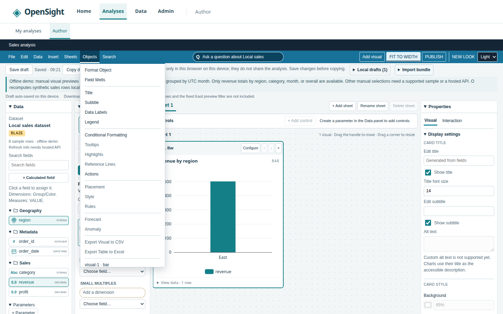

# Issue #60 — Author menu bar parity

The Author toolbar follows the supplied File, Edit, Data, Insert, Sheets,
Objects, Search menu specification. This change uses the existing editor
capabilities; it adds no dependencies or hosted services.

File keeps Import and definition exports (.qs and JSON), adds Rename, and
uses the same honest Publish notice as the toolbar. Exports expands the two
existing download choices. Favorites, Save as Analysis (a separate copy),
Share, Print, and PDF export are unavailable with specific reasons. Autosave
On is a checked, read-only status for device-local autosave; storage failures
are exposed in its explanation. This status does not claim a successful save.

Unavailable actions remain keyboard reachable with `aria-disabled`, cannot
run a handler, and explain why on focus or hover and through their accessible
description. Menus retain native disclosure keyboard behavior, Escape and
outside-click closure. No reference screenshots belong in this repository.

Edit opens Analysis theme in Properties, even from the Interaction tab or a
collapsed dock. Undo, Redo and Analysis Settings explain their missing editor
support. Theme controls require a dataset because the empty editor has no
Properties dock.

Data opens the Data dock, data sources (or preparation when that is the
available entry point), calculated fields, and parameters. Prepare data is
retained below the reference items. Navigation checkpoints unsaved work using
the existing draft guard. Add Parameter opens the existing editor and focuses
the name; repeated activation keeps it open, with an explicit Cancel action.

Insert creates sheets, bar visuals (change type in Visuals), and insight
visuals. Q opens the existing local deterministic question panel, preserving
its no-AI/hosted disclosures. Calculated fields, filters and parameters open
their existing editors; filters require a selected visual. Text and image
objects remain unavailable. Data-dependent actions are disabled without data.

Sheets adds, duplicates, and renames sheets using the existing controls and retains sheet
switching below the reference items. Sheet tabs also appear before data is
added, so these actions have a visible result. Add Title and Add Description
create styled text objects at the top of the sheet; Layout Settings configures
per-sheet row height and item spacing, persisted in the analysis definition.
Existing canvas dragging/resizing and FIT TO WIDTH are unchanged.

Objects opens Format Object, Field Wells, Title, Subtitle, Data Labels, Legend,
Conditional Formatting and Actions. It reveals the correct Properties tab and
all collapsed ancestors, then moves keyboard focus. Label/legend availability
matches the renderer's visual-type capability checks. All reference actions
require a selected visual. Visual selection and removal remain below them.
Tooltips customization, highlights, reference lines, numeric placement,
per-card style, visibility rules, forecast/anomaly authoring and CSV/Excel
query-result exports explain their missing editor support.

Search and Cmd/Ctrl+F open the #53 command palette with “Search analysis
actions”. Cmd/Ctrl+K retains its global entry point. Enabled menu items
register their own guarded callbacks with the same palette; unavailable
commands are omitted. Sheet/visual navigation and field search are retained
as commands, including finding visuals on another sheet. Menu registrations
are removed on navigation. Search restores focus through the existing modal
lifecycle; no second search implementation or dependency was added.

## Browser verification and media

The rebuilt static demo was compared qualitatively with all seven supplied
local menu references. Reference images were viewed locally and were never
copied into the repository. The implementation retains the navy/blue toolbar,
Arial system font stack, 12px controls and 4/8px spacing. Dropdown order and
separators follow the reference. OpenSight retains its product navigation,
explicit demo disclosures, and existing sheet/visual selection actions.

Objects now exposes all reference actions in a taller desktop dropdown.
Menus scroll on narrow screens to fit below the wrapped toolbar. The desktop
menu is wider and more spacious than the reference; icons and exact pixel
fidelity remain unmeasured. Search deliberately opens the shipped command
palette instead of adding another search popover. Unsupported feature work
remains identified by the disabled item explanations above; no GitHub calls
or phase-plan edits were made under the offline/no-spec-edit brief.

The final browser tour passed with **27 recorded checks, zero page errors,
and zero external HTTP requests**. It exercised menu order, disabled reasons,
Escape and outside-click dismissal, focus across collapsed docks and both
Properties tabs, calculation/parameter/Q dialogs, sheet actions, palette
execution and focus return, field and cross-sheet visual lookup, definition
exports and .qs import, and preparation navigation. Viewports: 1440, 760 and
390px in both light and dark themes. The separate root-wired Chromium geometry
suite also covers 1100px and checks the mobile menu height limit.

Captures and logs stay in ignored `.opensight/issue-60/browser/`. The supplied
demo shim was used with only its output destination redirected there to
respect the capture-location constraint; `packages/web/dist` was rebuilt from
source. This is a local static demo, not a deployed server.

The supplied fixed README capture script was adapted to this demo and capture
directory, with File, Objects and Search scenes added. Capture and the supplied
ffmpeg palette/assembly workflow passed: **59 frames, 960×600, 10fps, 5.9s**;
no page errors. The hero GIF, Author screenshot and command-palette screenshot
were refreshed, and the new Objects menu screenshot is shown below.

## Final verification

Root `TZ=UTC npm test` exited 0: **1,941 passed / 0 failed / 12 skipped /
0 cancelled** (1,953 tests). Every skip requires live PostgreSQL; no database
was configured. Strict TypeScript checks passed as part of the workspace run.

| Suite | Passed | Failed | Skipped |
| --- | ---: | ---: | ---: |
| API | 304 | 0 | 10 |
| Bundle parser | 199 | 0 | 0 |
| Embedding SDK | 9 | 0 | 0 |
| Interpreter | 32 | 0 | 0 |
| Parity | 11 | 0 | 0 |
| Query engine | 502 | 0 | 2 |
| Web | 878 | 0 | 0 |
| Root conformance | 6 | 0 | 0 |

The initial foreground run was terminated by the execution environment. A
complete rerun identified two old assertions reading the native `disabled`
property instead of the menu's keyboard-reachable `aria-disabled` state. Both
were updated without changing availability checks; the final full rerun above
passed. Logs and machine-readable counts are in the ignored issue directory.
No dependency, backend service, or solution-design change was required.
