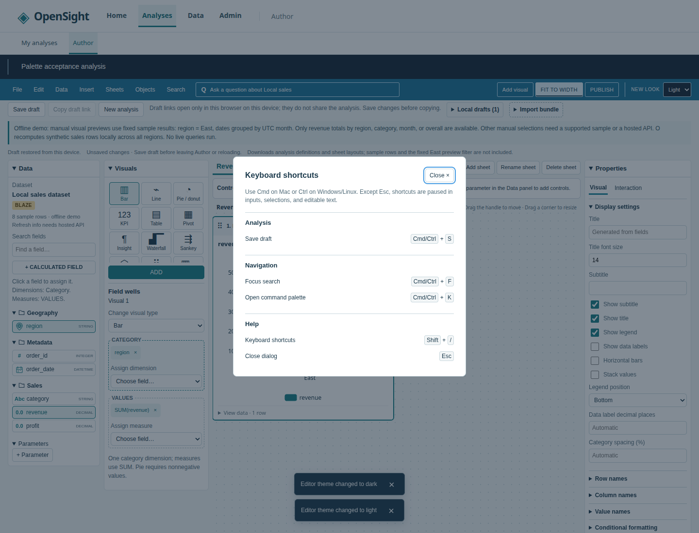

# Author keyboard shortcuts

Press **? (Shift+/)** in Author to open the grouped shortcut list.
Use **Cmd** on macOS or **Ctrl** on Windows/Linux; both modifiers are accepted.

| Shortcut | Action |
| --- | --- |
| Cmd/Ctrl+S | Save the current device-local draft; show **Draft saved** through the existing toast host only after success. |
| Cmd/Ctrl+F | Open the toolbar's **Search** menu and focus **Search analysis**. |
| Cmd/Ctrl+K | Open the [command palette](command-palette.md) for navigation and available actions. |
| ? (Shift+/) | Open **Keyboard shortcuts**. |
| Esc | Close the current dialog through its existing dismissal handler. |

Except Esc, shortcuts do not run in inputs, textareas, selects, or
contenteditable elements (including descendants). Composition events,
`isComposing`, and the legacy IME key code 229 suppress dispatch. Repeated or
already-consumed key events and extra modifiers are ignored. Native modal
dialogs pause background actions; Esc keeps the browser's native cancel
behavior. Ask Q yields Escape to a native modal above it. Help uses a named
native dialog with a focused Close button and restores focus when dismissed.

Save, Search, and Help are attached only while an authorized Author workspace is
mounted. The command palette is available across application pages. Navigating
away, losing build access, or failing to open a saved analysis removes the
Author shortcut listener. Saving reuses the manual
`useLocalDrafts().save()` path, including its error reporting and storage scope.
Saving remains device-local, without autosave or synchronization.
See [local drafts](local-drafts.md) for device-local storage limits.

## Registry and extension

- `packages/web/src/keyboard-shortcuts.ts`: `AUTHOR_SHORTCUTS`, key matching,
  displayed key combinations, document listener and cleanup.
- `packages/web/src/AuthorShortcuts.tsx`: Author action bindings and the help
  dialog. Its save callback always sees the latest draft without resetting
  composition state when Author renders.
- `packages/web/src/Author.tsx`: one save callback shared by the button and
  keyboard action, using issue #50's `useToast()` dispatch API.
- `packages/web/src/AuthorToolbar.tsx`: existing search field and focus helper.

To add a shortcut, add its stable ID, label, group, and key to
`AUTHOR_SHORTCUTS`. Set `modifier: true` for a Cmd/Ctrl binding. Add its action
to `AuthorShortcuts`. The shared palette listener registers only its own action;
missing actions leave the browser event untouched. The help list and key
rendering come from the registry.
Keep native Escape unconsumed so dialogs retain their cancel and focus behavior.
The palette uses the same typing and modal guards, with its own arrows and Enter
handling inside the dialog.

Add simulated keyboard coverage in
`packages/web/test/keyboard-shortcuts.test.mjs` and action/UI coverage in
`packages/web/test/author-shortcuts.test.mjs`. These use Node's test runner,
EventTarget, and the existing React test renderer; they need no browser or new
dependency and run through the existing root `npm test` workspace glob.
