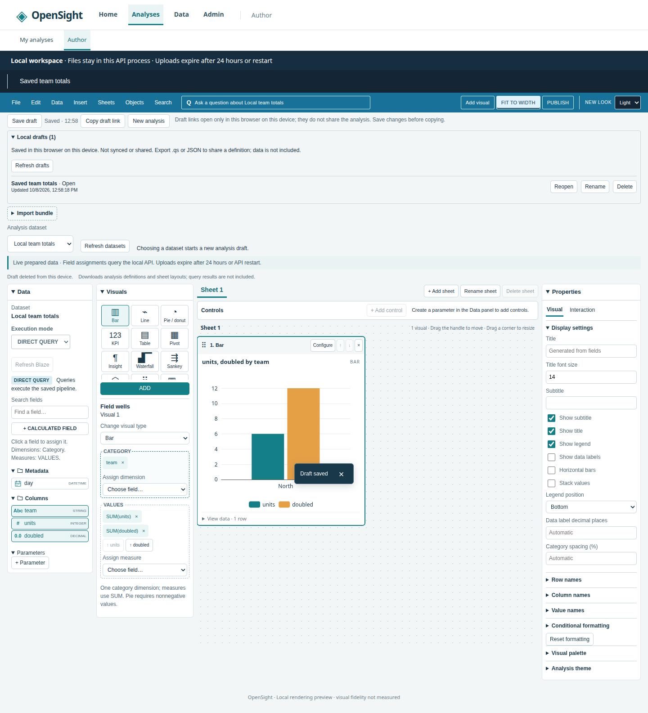
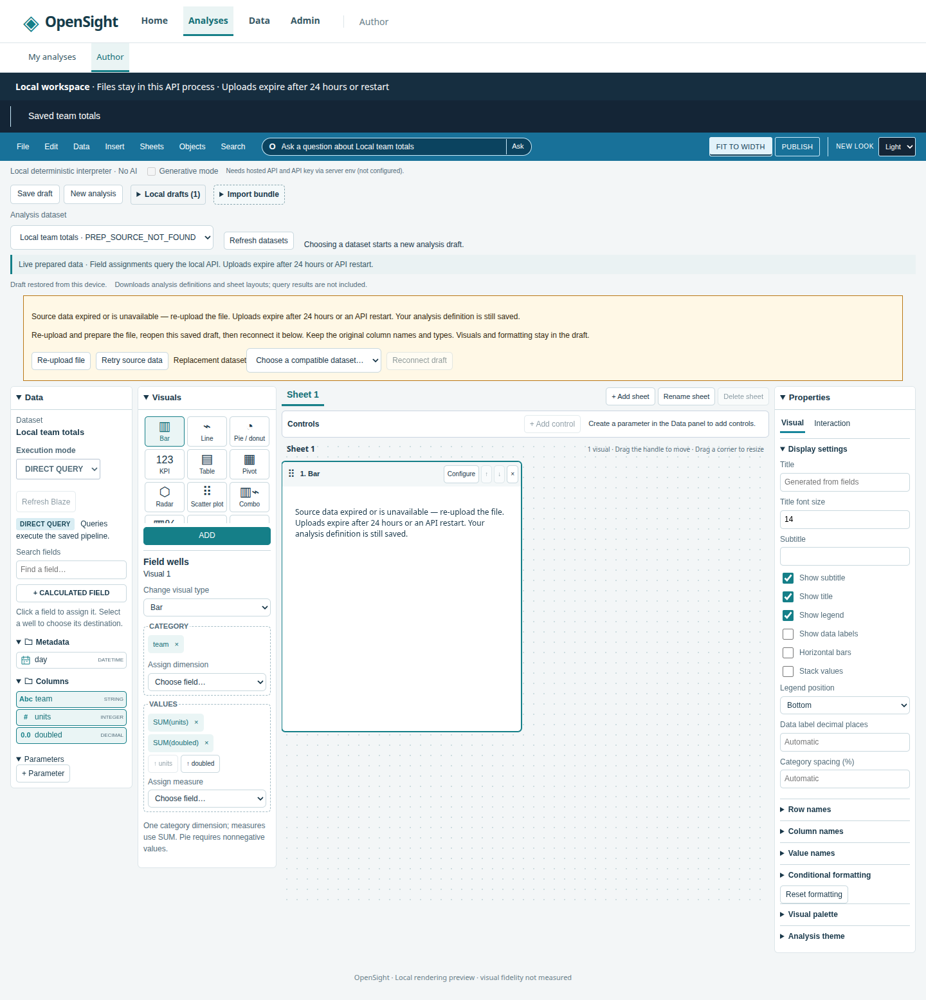

# Local analysis drafts

Open **Analyses → My analyses** for the device-local draft list, or **New
analysis** to start blank. Reopen opens the selected draft in Author with a
reloadable URL. The list also remains available inside Author. See
[app navigation](app-navigation.md) for routes and role visibility.

In Author, use **Save draft** or **Cmd/Ctrl+S** before leaving the editor or
reloading (keyboard shortcuts pause while typing in a field). Press **?** for
the [shortcut list](keyboard-shortcuts.md). **Local
drafts** lists saved analyses by name and updated time, most recent first. Each
entry offers **Reopen**, **Rename**, and **Delete**. **New analysis**, choosing
another dataset, importing a bundle, and reopening another draft checkpoint
existing edits first. A failed checkpoint leaves the current analysis open.
Deleting the open draft clears the editor; it is not automatically saved again.
Other navigation does not autosave; the editor labels unsaved changes.

Drafts contain analysis definitions: visuals, field assignments, formatting,
sheets and layouts, parameters, calculations, themes, and dataset references.
Imported bundle definitions retain their original resources for .qs export.
Query results and uploaded file rows are not stored in drafts.

Storage is browser **localStorage**, scoped to the current origin (scheme,
hostname and port), browser profile, and device. Local mode and the static demo
have separate collections. Hosted collections also separate namespace and user
IDs; browser storage itself is not an authentication or encryption boundary.
Hosted API authentication and authorization are unchanged. Nothing is uploaded,
synced, published, or shared by saving a draft. Changing origins or browser
profiles will not show the old collection. Clearing site data removes drafts;
private browsing may discard them when the session ends. Storage for a `file://`
static demo depends on browser policy and its file location.

The collection allows **20 drafts** and **2,097,152 UTF-16 code units** (at most
4 MiB). Small definition-only JSON records fit synchronous localStorage; one
atomic collection write keeps the list and active draft consistent without an
IndexedDB dependency. The browser may enforce a lower quota, especially when
other site data uses space. No old drafts are silently evicted. The UI identifies
blocked storage, quota failures, or an invalid definition and still offers
**File → Export JSON** / **File → Download .qs**. Multi-tab edits to one draft
use the last successful save; refresh the list to see other tabs' changes. A deleted draft is
not silently recreated by another tab's save.

Existing single-draft keys (`opensight.author.v0` in the demo and
`local.opensight.author.v0` locally) are validated and migrated into the list on
its first write. Their originals remain untouched. Legacy drafts have an unknown
update time until saved or renamed. The formerly shared key is not assigned to
hosted users. New keys start with `opensight.author.drafts.v1`. Definitions and
collection metadata read from storage are untrusted and validated. Corrupt
entries cannot open or execute, but can be deleted individually. An unreadable
collection is left unchanged and reported; export current work before clearing
that site's storage manually.

## Expired uploaded data

Local uploads expire after **24 hours** or an **API restart**. Drafts do not
extend that lifetime. On reopen, the editor checks the saved prepared dataset;
missing sources show **Source data expired or is unavailable — re-upload the
file**, with no sample-data fallback. Other source errors and changed schemas
also block the chart and explain the problem. An API connection failure is shown
separately and can be retried. Existing Blaze cache lifetimes remain unchanged.

Choose **Re-upload file**, then prepare and save the replacement dataset with
the original column names and types. Return to Author, reopen the original
saved draft, choose the compatible **Replacement dataset**, and select
**Reconnect draft**. Save the repaired draft. Its visuals, formatting, layouts,
and calculations stay intact. If the original pipeline is repaired in place,
use **Retry source data**. Incompatible schemas are rejected rather than mapped
silently. See [local data](local-data.md) for upload and pipeline limits.

## Publish and sharing

**PUBLISH** is an informational stub. Local and static modes have no publication
destination: drafts are device-local and unsynced. Export .qs or JSON to share
a definition; recipients still need its source data. Hosted mode explains that
publication needs a configured hosted deployment and is not available in this
editor yet. There is no new server draft store, sync, or publication endpoint.
